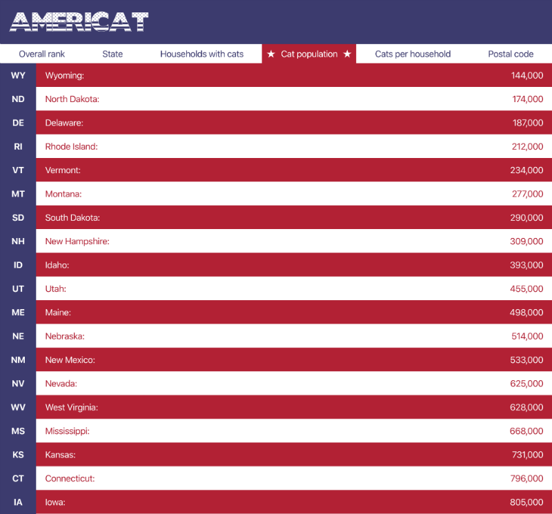

# Americat

Learning some Python and Svelte



### Start presentation
Download via [slides.pdf](slides.pdf) or start via 
```
yarn slides:start
npm run slides:start
```

### Start App

```
yarn start
npm run start
```

### Install App

```
yarn install
npm install
```

## Issues
Syntax Highlighting Sass:  
Sass + vscode = https://github.com/UnwrittenFun/svelte-vscode/issues/1#issuecomment-495927947